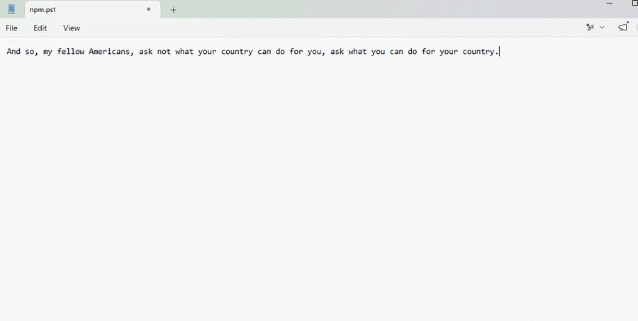
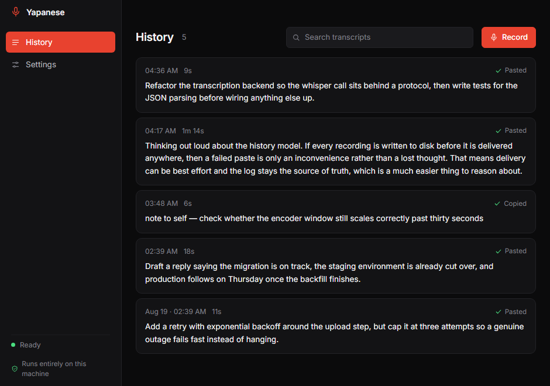
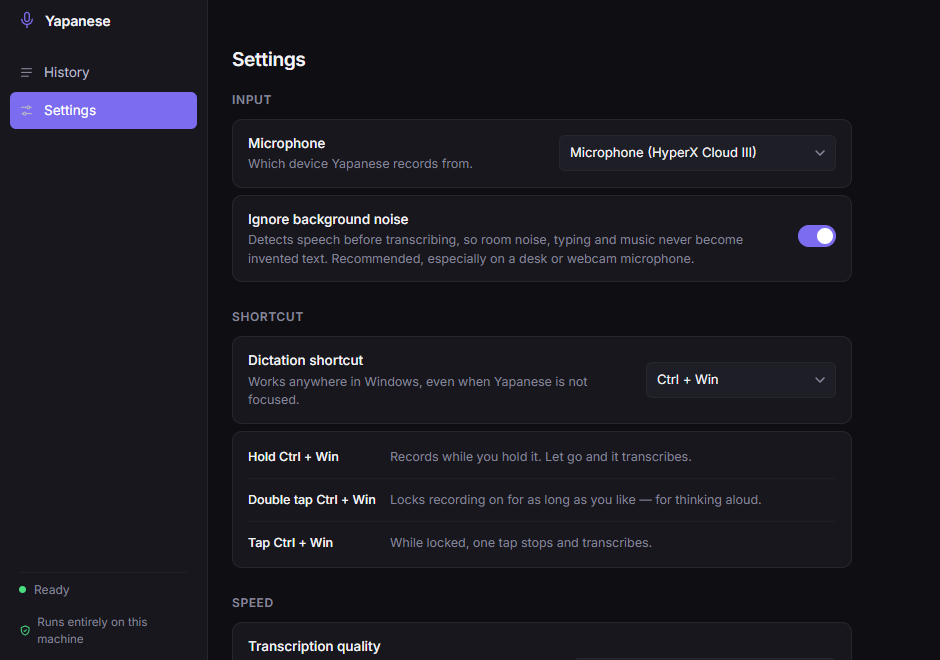

<div align="center">


# Yapanese

### Local dictation for Windows. Hold a key, talk, and the text lands where your cursor is.

No account. No cloud. No per-minute billing. Nothing leaves your machine.

[](https://github.com/IndyIsaac/yapanese/actions/workflows/build.yml)
[](LICENSE)


<br>

<a href="https://github.com/IndyIsaac/yapanese/releases/latest">
  
</a>

<sub>Windows 10 or 11, 64-bit · no account, no sign-up · sets itself up on first launch</sub>

<br>



<sub><b>Real capture.</b> Audio through a webcam microphone, transcribed locally in 866&nbsp;ms.</sub>

</div>

<br>

## Why this exists

Dictation on Windows usually means a subscription and your voice on someone
else's server. The models that make it work are open, run locally, and are fast
enough on ordinary hardware. What's missing is the part that makes them
disappear into your workflow.

That's this: a tray app, one global shortcut, and your words in whatever window
you were already using.

## What it does

| | |
|---|---|
| **Hold to dictate** | Hold the shortcut, talk, let go. The text pastes into the focused app. |
| **Double tap to lock** | Locks recording on for long-form thinking aloud. Tap once to stop. |
| **Searchable history** | Every transcript is saved locally *before* delivery, so a failed paste is an inconvenience, never a lost thought. |
| **Ignores the room** | Voice activity detection discards background noise, so a desk or webcam mic doesn't produce invented sentences. |
| **Uses your GPU** | Runs on CUDA when a compatible whisper.cpp build is present, otherwise CPU. |

<br>

<div align="center">


</div>

## Speed

Measured on an Intel i7-14700F with an RTX 5050, model `large-v3-turbo-q5_0`:

| audio length | CPU | GPU |
|---|---|---|
| 2 seconds | 2.0 s | **0.8 s** |
| 11 seconds | 2.6 s | **0.9 s** |

Whisper's encoder always processes a fixed 30-second window, so a two-second
clip costs the same as a thirty-second one unless you cap it. Yapanese sizes
that window to the actual clip — most of the distance between "instant" and
"why is this taking so long".

## Install

Two steps. The installer is the first one.

### 1 · Install the app

**[Download the installer](https://github.com/IndyIsaac/yapanese/releases/latest)** and run it. No
cloning, no toolchain, no build step — it installs to your user account, so it
does not ask for administrator rights.

Windows will warn you on first run because the installer is unsigned; see
[Honest limitations](#honest-limitations).

### 2 · Let it set itself up

Yapanese opens on a setup screen the first time you run it. It checks what
your machine already has and downloads the rest — the transcription engine and
the speech model. Press one button and wait about a minute.

> **Dictation does not work until this finishes.** The shortcut, the tray
> item and the Record button are all disabled until it does, deliberately:
> a recording that cannot be transcribed is a thought you have already said
> out loud and cannot get back.

It picks the NVIDIA build if it finds a suitable card and the CPU build
otherwise, and you can override that. Everything it downloads is pinned to a
published release and checked against a SHA-256 before it is installed.

After that, the app makes no network requests at all.

<details>
<summary>Or build it from source</summary>

```powershell
git clone https://github.com/IndyIsaac/yapanese.git
cd yapanese
npm install
npm run dist       # -> dist\Yapanese-Setup-<version>.exe
npm start          # or just run it from source
```

Running from source shows Electron's icon in the taskbar rather than
Yapanese's, because the process really is `electron.exe`. The installed build
does not have this problem.

</details>

### What setup installs

| | | |
|---|---|---|
| **whisper.cpp** | 8 MB · CPU<br>640 MB · CUDA | The program that transcribes. Lands in `%LOCALAPPDATA%\yap\bin`. |
| **Speech model** | 547 MB | `large-v3-turbo-q5_0`. Lands in `%LOCALAPPDATA%\yap\models`. |
| **Voice detection** | 865 KB | Silero, so room noise never becomes invented text. |

The CUDA build is large because it carries NVIDIA's own libraries, and worth
it: 2.0 s becomes 0.8 s on the clip in the table above. Its first run pays a
one-time CUDA compilation cost — if it is slow once and fast forever after,
that is why.

<details>
<summary>Or install the prerequisites yourself</summary>

Setup is a convenience, not a requirement. Put
[`whisper-cli`](https://github.com/ggml-org/whisper.cpp/releases) on your
`PATH` or in `%LOCALAPPDATA%\yap\bin`, and the
[models](https://huggingface.co/ggerganov/whisper.cpp) in
`%LOCALAPPDATA%\yap\models`, and Yapanese will find them and skip the screen
entirely. It only ever removes files it installed itself.

`node tools/test-setup.js` reports what it can see, and
`--install` runs the same code the screen does, without the UI.

</details>

<details>
<summary>Uninstalling</summary>

The uninstaller removes the app. It deliberately leaves
`%LOCALAPPDATA%\yap` alone — that folder is shared with the `yap` CLI if you
have it, and silently deleting somebody else's tool is not the uninstaller's
call. Delete it by hand to reclaim the download.

Your transcripts live separately in `%APPDATA%\Yapanese` and are also left
behind, so reinstalling keeps your history.

</details>

## Usage

Default shortcut is **Ctrl + Win**, changeable in Settings.

| gesture | result |
|---|---|
| **Hold** | Records while held, transcribes on release |
| **Double tap** | Locks recording on indefinitely |
| **Tap** while locked | Stops and transcribes |

## How it works

```
global keyboard hook
  └─ capture ............ Web Audio, 16 kHz mono, hidden renderer
      └─ WAV ............ written straight to temp — no conversion step
          └─ whisper-cli --vad ...... speech detection, then transcription
              └─ history ............ saved before delivery is attempted
                  └─ clipboard + Ctrl+V into the focused window
```

Three decisions worth explaining:

**The transcript is saved before it is delivered.** Delivery is allowed to be
best-effort because the record is already safe.

**Text is pasted, not typed.** Synthesised keystrokes mangle Unicode and
anything the Windows key API treats as syntax. A clipboard paste moves the whole
string verbatim in one keystroke; your previous clipboard is restored after.

**A keyboard hook, not a registered shortcut.** Windows global shortcuts only
report key-down and refuse modifier-only combinations, so neither hold nor
double-tap is possible with them.

## Settings

| Setting | Default | |
|---|---|---|
| Microphone | system default | Any input Windows exposes |
| Shortcut | Ctrl + Win | Also Alt+Win, Ctrl+Shift, Win |
| Ignore background noise | on | Voice activity detection |
| Transcription quality | Balanced | Accurate · Balanced · Fast |
| Paste automatically | on | Off copies to clipboard instead |
| Keep the indicator on screen | on | Off shows it only while dictating |
| Start with Windows | off | Launches hidden in the tray |

### The indicator

At rest it is a small badge — a green light and a microphone. Drag it
anywhere; it stays where you put it and comes back there next launch.
Clicking it opens your history.

Start dictating and it blooms outwards from that spot into the full pill:
live levels and a running clock while you talk, then a line saying whether
the words were pasted or copied and how many there were. Then it folds back
to the badge. A copied transcript stays up longer than a pasted one, because
it is a job you still have to finish.

It is deliberately present when idle rather than appearing only once you
start talking: an indicator you cannot see is indistinguishable from an app
that has stopped working. It recedes into the desktop when you are not near
it and comes forward when your pointer is. If it is genuinely in the way,
turn it off in Settings and it reverts to showing only while dictating.

An amber light instead of green means setup is unfinished — and dictation is
refused until it is done.

Transcripts live as plain JSON in `%APPDATA%\Yapanese` — readable, portable and
deletable without this app being involved.

## Updates

Yapanese checks GitHub for a newer release a few seconds after launch and
every six hours after that. When there is one, a bar appears at the top of the
window: what the version is, one line on what changed, and a button.

Nothing is downloaded until that button is pressed. An app that quietly pulls
a hundred megabytes over somebody's tethered connection has made a decision
that was not its to make — and this one is otherwise careful never to touch
the network. Once downloaded, the update applies on a restart, which the app
does for you.

<details>
<summary>Cutting a release</summary>

The version in `package.json` is what the update check compares against, so
it has to go up, and the tag has to match it.

```powershell
npm version minor        # or patch — writes package.json and commits
git push origin main --follow-tags
```

The tag triggers `.github/workflows/build.yml`, which builds the installer and
attaches three things to the release: the `.exe`, its `.blockmap`, and
`latest.yml`. **All three matter.** `latest.yml` is the feed — without it in
the release, existing installs have no way to discover the new version and
will silently never update. The blockmap is what lets an update download only
the changed parts rather than the whole installer. The workflow fails loudly
if `latest.yml` was not produced.

Whatever you write in the GitHub release body is what users see as the "what
changed" line, so the first line should be a sentence a non-technical person
can act on.

</details>

## Honest limitations

- **Windows only.** The keyboard hook, paste path and tray behaviour are all
  platform-specific.
- **Yapanese sees every keystroke while running.** A low-level keyboard hook is
  the only way to detect hold and double-tap gestures. Non-shortcut keys are
  discarded immediately, nothing is logged or stored, and nothing is
  transmitted — but it is a real capability and you should know it is there.
- **The installer is unsigned.** SmartScreen will warn on first run until the
  binary builds reputation. Signing needs a certificate. Updates are verified
  by SHA-512 against the release feed rather than by a signature, which
  protects against a corrupted download but not against a compromised GitHub
  account.
- **Accuracy depends on your microphone.** A far-field webcam mic works — that
  is what the demo was recorded with — but a close mic is better, as with any
  speech recognition.

## Contributing

Issues and pull requests are welcome. `npm start` runs it from source;
`tools/` holds the scripts used to test the capture, paste, gesture and setup
paths without needing a human to speak into the microphone.

Bumping the pinned whisper.cpp release means editing `WHISPER_RELEASE` in
`src/main/setup.js` along with the byte counts and SHA-256 of each artifact —
`Get-FileHash -Algorithm SHA256` produces them, and
`node tools/test-setup.js --install` proves they are right against the real
endpoints.

One trap if you touch the indicator. **Never use `win.setPosition` on it, and
never size the window to something the renderer measured.** On a fractionally
scaled display — 150% is the common one — `getBounds` reports the *enclosing*
DIP rectangle, so a size read back is a pixel larger than the size that was
set. `setPosition` does that read-modify-write internally, so it inflates the
window on every call: measured, 300 calls took a 170×42 window to 469×343, and
a drag makes about 125 of those a second. Reposition with `setBounds` and state
the width and height explicitly, chosen from a constant. The indicator has two
sizes and the renderer selects between them **by name**, never by measurement,
for exactly this reason.

## Credits

Built on [whisper.cpp](https://github.com/ggml-org/whisper.cpp) by Georgi
Gerganov and contributors, and OpenAI's [Whisper](https://github.com/openai/whisper)
models. Started life while porting [finnvoor/yap](https://github.com/finnvoor/yap)
to Windows — hence the name.

Full attribution in [THIRD-PARTY.md](THIRD-PARTY.md).

## Licence

[MIT](LICENSE).
